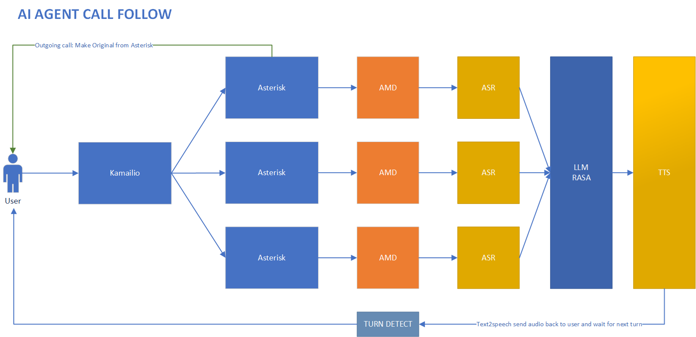

# Building an AI Voice Agent with Asterisk: Stream Extraction Methods for ASR Integration

Modern AI Voice Agents are transforming phone-based interactions by enabling human-like conversations over calls. These agents are powered by real-time speech processing pipelines that include audio extraction, speech recognition, natural language understanding, and response generation. For developers building such agents on top of **Asterisk**, knowing how to access and process audio streams is key.

---

## 🔧 Architecture of an AI Voice Agent

A complete AI Voice Agent typically consists of:

1. **AMD (Answering Machine Detection)** – Filters out voicemails to save processing resources.
2. **Turn Detection** – Determines when the caller has finished speaking before triggering the AI’s response.
3. **ASR (Automatic Speech Recognition)** – Converts caller audio to text.
4. **LLM (Large Language Model or NLU engine)** – Understands intent and generates replies.  
   ✅ *On-premise option:* Use **Rasa** as a local NLU engine to avoid sending data to cloud-based models.
5. **TTS (Text-to-Speech)** – Converts AI-generated text back to speech for playback.

This architecture requires that audio be extracted from the call in real-time or near-real-time, and Asterisk offers several methods to support this.

---

## 🔄 5 Methods to Extract or Analyze Audio from Asterisk

### 1. AGI (Asterisk Gateway Interface)

AGI scripts allow you to record short user responses or prompts and pass them to ASR for interpretation.

- **Pros:** Simple, no external API needed  
- **Cons:** Not real-time, limited to synchronous prompts

---

### 2. ARI (Asterisk REST Interface)

ARI provides low-level control over media and channels, including real-time audio streaming via WebSocket. You can stream audio directly to ASR and receive transcripts instantly.

- **Best for:** Real-time voicebot interaction  
- **Can integrate with:** ASR (e.g., Vosk, DeepSpeech), LLM (e.g., Rasa NLU), TTS (e.g., Coqui)

---

### 3. Record to File (MixMonitor / Monitor)

This saves the entire call to a file for offline processing. You can analyze it later using ASR and LLM to generate summaries, QA reports, or training data.

- **Use case:** Post-call analysis, training AI models  
- **Drawback:** No real-time interaction

---

### 4. SIPREC (SIP Recording Protocol)

SIPREC duplicates the media stream to an external recording/processing server in real-time. Perfect for passive ASR and analytics without interrupting the primary call.

- **Scalable:** Ideal for high-volume call centers  
- **Can route to:** ASR pipeline, custom RTP server, or media proxy

---

### 5. AMD (Built-in Asterisk Feature)

This module analyzes the initial portion of the call to determine whether the other party is a person or a machine (voicemail). It helps AI agents avoid wasting processing power on voicemail recordings.

---

## 🧠 Example: On-Prem AI Agent Stack

For a privacy-focused or air-gapped deployment, your full AI stack may look like:

- **Asterisk** – PBX and audio router  
- **ARI** – Audio streaming API  
- **Vosk / DeepSpeech** – ASR engine (on-prem)  
- **Rasa NLU/Core** – Intent detection and dialogue manager (on-prem)  
- **Coqui TTS / eSpeak** – Text-to-speech engine  
- **Optional** – Turn detection service (e.g., custom silence detection)

---

## ✅ Conclusion

Whether you're deploying AI voice agents on cloud or on-premise, Asterisk provides multiple paths to integrate with ASR and LLM components. By combining:

- **AGI or ARI** for audio handling  
- **SIPREC** for stream duplication  
- **AMD** for intelligent filtering  
- and **Rasa** for on-premise LLM/NLU,

you can build scalable, real-time voice AI systems that respect privacy, work in local environments, and provide intelligent human-like interactions over the phone.
